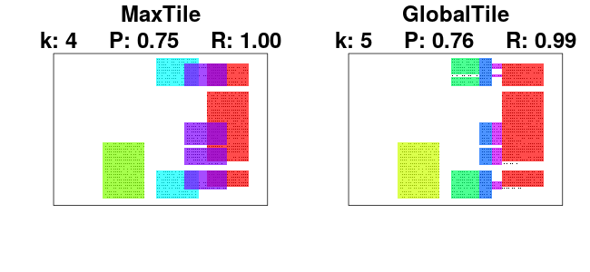

semigeom
=========

The `semigeom` package provides functions for performing semigeometric tiling of data matrices. The basic idea is to find regions in data matrices where the density of some feature, e.g., ones in a binary matrix, is large enough, as specified by some threshold. A brief illustrative example is provided below. The exact technique is described in the paper (to appear)

_
Andreas Henelius, Isak Karlsson, Panagiotis Papapetrou, Antti Ukkonen and Kai Puolamäki. Semigeometric Tiling of Event Sequences. European Conference on Machine Learning and Knowledge Discovery in Databases, 2016.
_

Citing
------
To get a BibTex entry in R type `citation("semigeom")`.


Installation from GitHub
-----------------------
The development version of the `semigeom` package can be installed from GitHub as follows.

First install the `devtools`-package and load it:
```
install.packages("devtools")
library(devtools)
```

You can now install the `semigeom` package:
```
install_github("bwrc/semigeom-r")
```


Examples
---------
This is a short example demonstrating use of the library.

```R
## Load the library
library(semigeom)

## Create some example data
data <- make_dataset_list_synthetic()
X <- data$synthetic1

## Perform the tiling
tiles_mt <- max_tile(X, K = 4, alpha = 0.75)
tiles_gt <- global_tile(X, K = 5, alpha = 0.75)

## Plot the tiles
par(mfcol = c(1, 2))
plot_binary_matrix(X, tiles_mt, main = "MaxTile")
plot_binary_matrix(X, tiles_gt, main = "GlobalTile")
```

This produces the figure



License
-------
The `semigeom` R-package is licensed under the [MIT-license](http://opensource.org/licenses/MIT).
